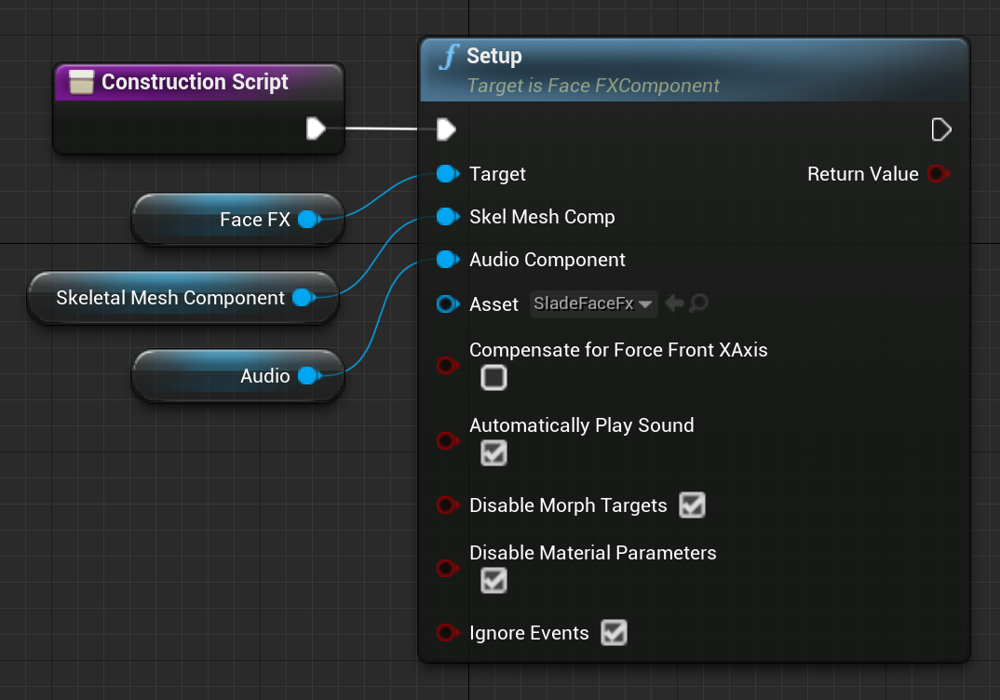
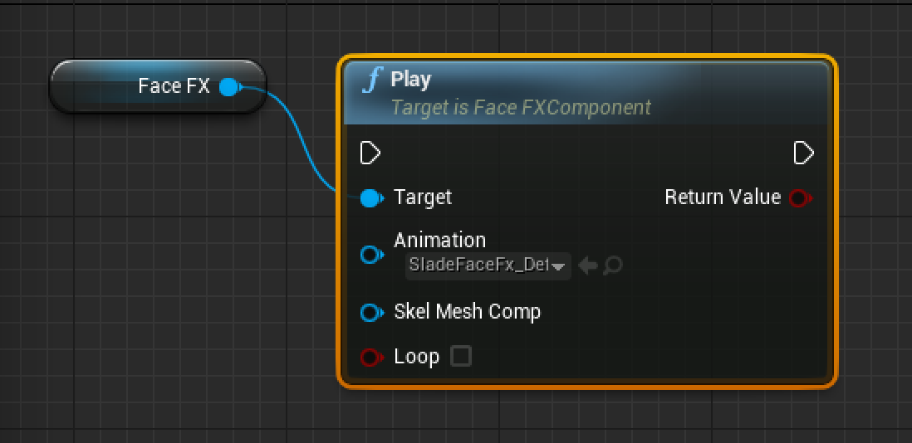
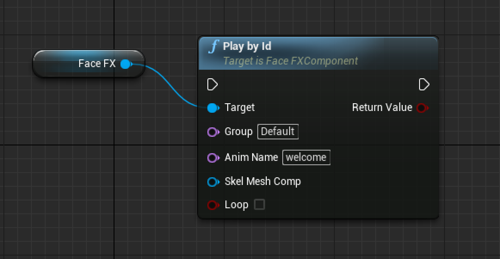
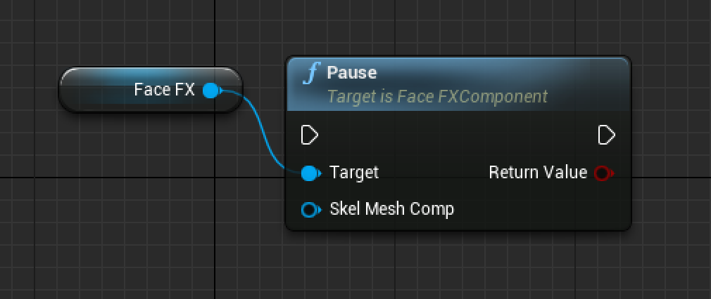
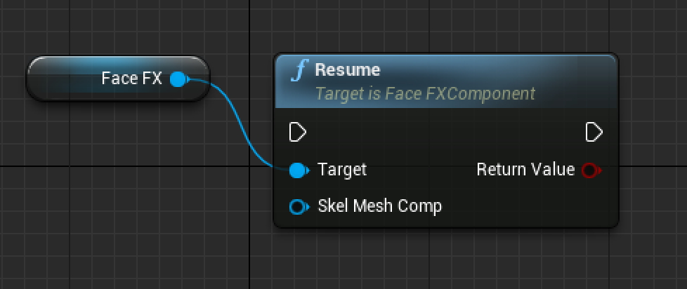
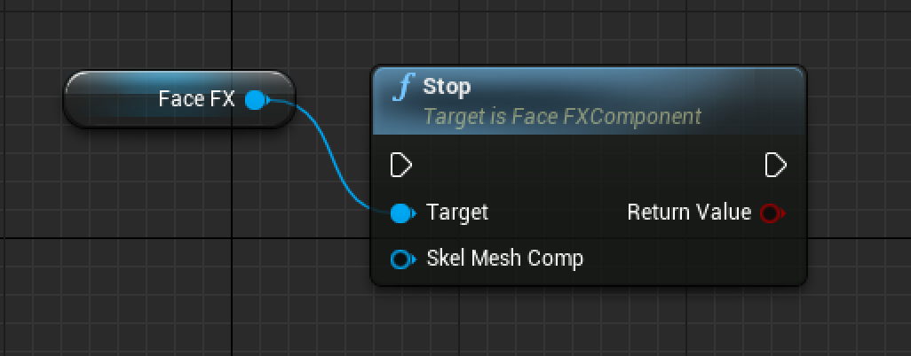
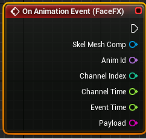

Blueprint Nodes
===============

The FaceFX UE4 Plugin provides several Blueprint nodes, which are described here.

All FaceFX Blueprint nodes require a **FaceFX Component** to be wired to their respective **Target** slots. The FaceFX Setup Blueprint node requires the **Skel Mesh Comp** slot to be wired with the **Skeletal Mesh Component** to animate. The **Skel Mesh Comp** is optional for the other FaceFX Blueprint nodes (this is so a single Blueprint can drive multiple FaceFX characters). If it is not supplied, the first one found is used.

Setup
-----

The FaceFX Setup Blueprint node initializes the linked **FaceFX Component** with the linked **Skeletal Mesh Component** and specified **FaceFXActor** asset. It must be called in the **Construction Script** before any other FaceFX Blueprint node.

+ The **Target** slot is required and should be wired to the **FaceFX Component**.

+ The **Skel Mesh Comp** slot is required and should be wired to the **Sekeltal Mesh Component** to animate.

+ The **Audio Component** property should be set to the Audio Component used to play the audio.

+ The **Asset** property is required and should be set to the **FaceFXActor** asset to be used for animation.

+ The **Compensate For Force Front XAxis** property should only be **checked** if **Force Front XAxis** was **checked** when the Skeletal Mesh was imported. Not keeping these settings in sync will result in FaceFX animations playing in the wrong coordinate system and can resemble an exploded face.

+ The **Automatically Play Sound** property is optional. When **checked**, the audio associated with the **FaceFXAnim** asset being played will automatically be started at the appropriate time.

+ The **Disable Morph Targets** property is optional. When **checked**, FaceFX will not animate any morph targets. When **unchecked**, any morph target on the character that has a matching target name in the specified **FaceFXActor** asset will be animated by FaceFX.

+ The **Disable Material Parameters** property is optional. When **checked**, FaceFX will not animate material parameters. When **unchecked**, any material parameter on the character that has a matching target name in the specified **FaceFXActor** asset will be animated by FaceFX.

+ The **Ignore Events** property is optional. When **checked**, [Events](Events.md) will be ignored.

Play
----

The FaceFX Play Blueprint node plays the linked **FaceFXAnim** asset.

+ The **Target** slot is required and should be wired to the **FaceFX Component**.

+ The **Animation** property is required and should be set to the **FaceFXAnim** asset to be played.

+ The **Skel Mesh Comp** slot is optional. It should be wired to the **Skeletal Mesh Component** to animate. If it is not set, the first **Skeletal Mesh Component** found is used.

+ The **Loop** property is optional. When set it causes the **FaceFXAnim** asset being played to loop continuously until manually stopped.

Play by Id
----------

The FaceFX Play by Id Blueprint node plays a **FaceFXAnim** asset using a string ID created in the form **Group/AnimName**. The **FaceFXAnim** asset *must* be linked to the **FaceFXActor** asset in order for it to be found and played.

+ The **Target** slot is required and should be wired to the **FaceFX Component**.

+ The **Group** property is optional. If set, it specifies the FaceFX animation group that contains the animation to be played. If not set, the first animation linked to the **FaceFXActor** asset found with the same name specified by the **Anim Name** property is played.

+ The **Anim Name** property is required. It specifies the name of the FaceFX animation to play.

+ The **Skel Mesh Comp** slot is optional. It should be wired to the **Skeletal Mesh Component** to animate. If it is not set, the first **Skeletal Mesh Component** found is used.

+ The **Loop** property is optional. When set it causes the **FaceFXAnim** asset being played to loop continuously until manually stopped.

Pause
-----

The FaceFX Pause Blueprint node pauses all FaceFX animations and audio files playing on an actor.

+ The **Target** slot is required and should be wired to the **FaceFX Component**.

+ The **Skel Mesh Comp** slot is optional. It should be wired to the **Skeletal Mesh Component** to animate. If it is not set, the first **Skeletal Mesh Component** found is used.

Resume
------

The FaceFX Resume Blueprint node resumes all paused FaceFX animations and audio files.

+ The **Target** slot is required and should be wired to the **FaceFX Component**.

+ The **Skel Mesh Comp** slot is optional. It should be wired to the **Skeletal Mesh Component** to animate. If it is not set, the first **Skeletal Mesh Component** found is used.

Stop
----

The FaceFX Stop Blueprint node stops all FaceFX animations and audio files playing on an actor.

+ The **Target** slot is required and should be wired to the **FaceFX Component**.

+ The **Skel Mesh Comp** slot is optional. It should be wired to the **Skeletal Mesh Component** to animate. If it is not set, the first **Skeletal Mesh Component** found is used.

On Animation Event
------------------

The **On Animation Event Node** in the **Event Graph** is created by selecting the **FaceFX Component** from the Blueprint and adding the **On Animation Event** from the **Events** section of the **Details** tab. Use this node to make use of the [event](Events.md) payload and other event properties (the Skeletal Mesh Component, Animation Id, Channel Index, Channel Time, and Event Time) in your game.