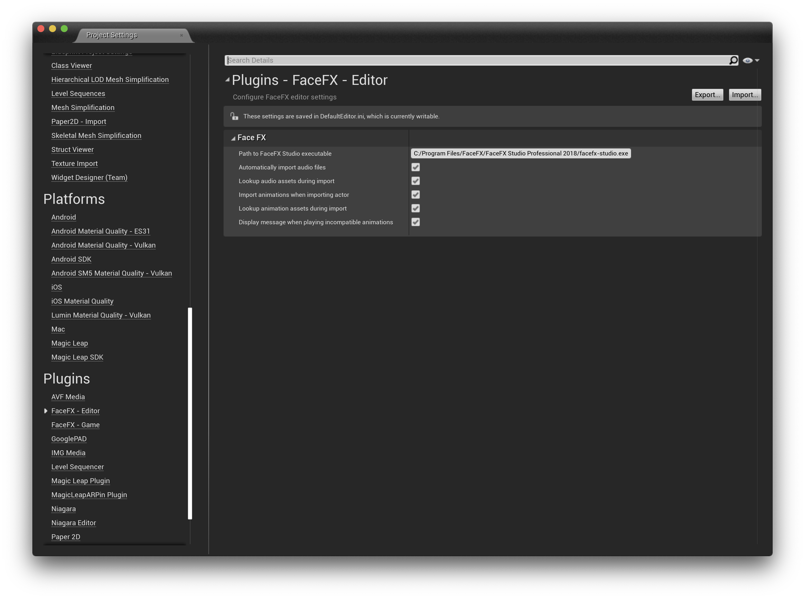
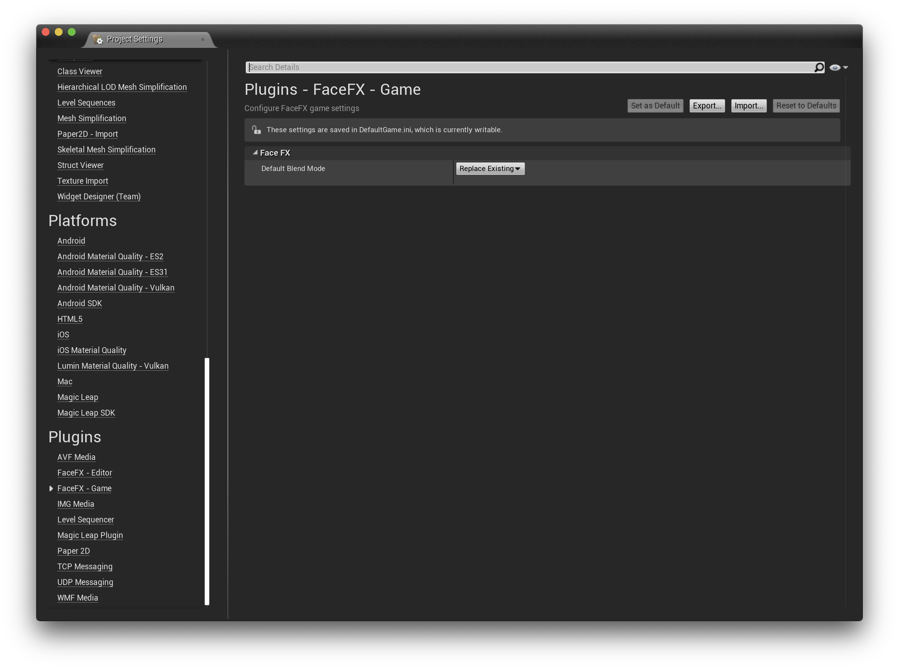

Configuration
=============

The FaceFX UE4 Plugin can be configured with several options contained in Plugins section of the Project Settings in
UnrealEd

Editor
------

##### Path to FaceFX Studio executable

The absolute path to the FaceFX Studio installation.

##### Automatically import audio files

Indicates if the audio data (.wav files only) should be automatically imported during the FaceFX Animation import process.

##### Lookup audio assets during import

Indicates if the import should search through all existing **USoundWave** assets and look for an asset that was generated with the linked sound source file (per FaceFX Animation). If one is found it will be used instead of creating a new **USoundWave** asset for the .wav file.

**Note:** This might affect performance when there are a lot of **USoundWave** assets.

##### Import animations when importing actor

Indicates if animations should be imported during FaceFX actor import. If set to false only the FaceFX Actor asset will be imported or updated.

##### Lookup animation assets during import

Indicates if the import should search through all existing **UFaceFXAnimation** assets and look for an asset that was generated with the linked **.ffxanim** source file. If one is found it will be used instead of creating a new **UFaceFXAnimation** asset for the **.ffxanim** file.

**Note:** This might affect performance when there are a lot of **UFaceFXAnimation** assets.

##### Display message when playing incompatible animations

Indicates if the editor should show a warning message when a **UFaceFXAnimation** is attempted to be played on an incompatible **UFaceFXCharacter**.

Game
----

##### Default Blend Mode

A global FaceFX blend mode setting. This global setting can be overridden in a FaceFX actor.

- Replace Existing

    FaceFX transforms replace the existing transforms.

- Add to Existing

    FaceFX transforms are additive and add to the existing transforms.

