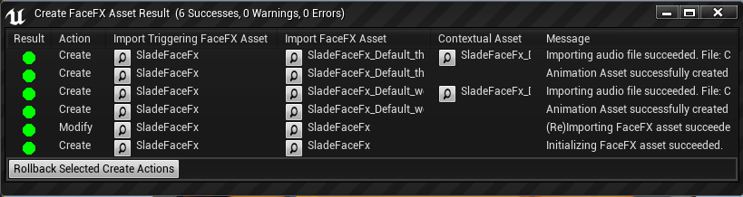

Errors and Warnings
===================

Animation Import Errors
-----------------------

##### FaceFX compilation folder does not exist

You need to compile your **.facefx** file with the FaceFX Runtime plugin for FaceFX Studio. This is what creates the **.ffxc** folder. When this error occurs, an invalid FaceFX actor asset is created. Be sure to delete or update it.

##### Importing audio asset failed

Make sure you only analyze **.wav** files from FaceFX Studio. UE4 can not import **.ogg** files for example.  

##### Audio file does not exist

The audio associated with the animation can not be found. The path to the audio comes from the **.ffxamap** file in the **.ffxc** folder. Paths are relative to the **.facefx** file path, and the **.facefx** file's path is relative to the path listed in the **Documents\FaceFX Studio 2018\facefx.clientspec** file. If your audio file does actually exist (check that first), this could be due to an error in your **facefx.clientspec** file if it has been modified by hand. Make sure the capitalization is correct (drive letters should be capitalized for example).

Animation Import Warnings
-------------------------

##### Skipped **.ffxanim** file with no audiomap entry. It may have been moved or deleted.

This warning occurs when the files in your **.ffxc** folder get out of sync. Do not modify, add, or delete files from the **.ffxc** folder. Even opening the folder should be avoided because it will prevent the FaceFX Runtime plugin for FaceFX Studio from deleting it when appropriate. Performing a *Rebuild all* will fix the issue. Also, avoid using the same filename for different **.facefx** files.

##### Linked animation asset does not contain an audio map entry. It may have been moved or deleted. Consider to delete that animation asset.

An animation that was previously imported and linked to the actor is no longer present in the actor. If the animation was deleted from the **.facefx** file, you will need to manually delete the Unreal asset.  

Console Errors
--------------

##### UFaceFXComponent::Setup. Missing Asset argument.

Open the Blueprint Class referenced in the error and assign a FaceFX actor in the FaceFX Setup node.

##### UFaceFXCharacter::Play. FaceFX Animation asset missing.

Open the Blueprint Class referenced in the error and make sure a FaceFX animation is assigned to all FaceFX Play nodes.

##### UFaceFXComponent::Play. FaceFX character does not exist for a given SkelMeshComp <None>.

The Play FaceFX node was used without properly initializing the character in a FaceFX Setup node.

##### UFaceFXComponent::Setup. Missing SkelMeshComp argument.

Open the Blueprint Class referenced in the error and attach the **SkeletalMeshComponent** to the FaceFX Setup node.

##### UFaceFXComponent::Setup. Missing Asset argument.

Open the Blueprint Class referenced in the error and set the **FaceFXActor** asset in the FaceFX Setup node.

##### UFaceFXCharacter::PlayAudio. Playing audio failed. Owning **UFaceFXCoponent** does not belong to an actor that owns an **UAudioComponent**.

Add the Audio component to the Blueprint Class.

##### UFaceFXCharacter::Load. Invalid FaceFXActor asset. Please reimport that asset.

The **FaceFXActor** asset is invalid. Compile your **.facefx** file with the FaceFX Runtime plugin for FaceFX Studio and reimport it.

##### SkeletalMesh Component FaceFX failed to get initialized. Loading failed. Component=FaceFX.

The **FaceFXActor** asset is invalid. Compile your **.facefx** file with the FaceFX Runtime plugin for FaceFX Studio and reimport it.

Console Warnings
----------------

##### LogFaceFX:Warning: FFaceFXEditorTools::LocateAudio Unable to find **USoundWave** assets for:

A **USoundWave** asset was automatically created for you and linked to the animation.

##### LogFaceFX:Warning: UFaceFXCharacter::Play Animation is not compatible with FaceFX Actor handle.

The specified animation was compiled with an actor that had a different **Face Graph**. Perform a **Rebuild all** from the FaceFX Runtime plugin for FaceFX Studio and reimport the FaceFX Assets for the actor.
