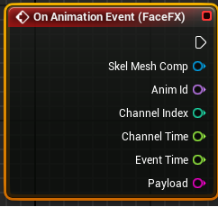

Events
=======

In-game actions can be triggered from animation events. Each animation can trigger multiple events at different times with unique string payloads. The string payloads are passed via Blueprint to trigger custom in-game systems.

Events are created from the Events tab in FaceFX Studio. While FaceFX Studio events can contain animation curves in addition to the event payload, all animation curves are baked into the parent animation by the compiler, leaving only the payload to be passed to an in-game system.

Events were added in version 2 of the FaceFX Runtime, first integrated with UE4.26.

Limits (Enforced by Compiler)
-----------------------------

+ Maximum 4096 events per animation

+ Maximum 7 concurrent events 

+ Maximum size of all payload strings in an animation is 65536 bytes

Tutorial
--------

+ Create a custom payload for an animation in FaceFX Studio. (Note that even if you do not plan to use the payload, you must specify a string for the compiler to include this event in the output data.)

+ Compile the animation using version 2 of the [FaceFX Runtime Compiler](RequirementsAndKeyConcepts.md).

+ Create the OnAnimationEvent node in your character's blueprint by selecting the **FaceFX Component** and adding the **On Animation Event** from the **Events** section of the **Details** tab. 

+ Wire up the OnAnimationEvent outputs, including the payload, to your in game system
