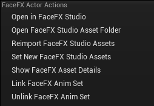

Iteration
=========

It is highly recommended that you familiarize yourself with the documentation of the FaceFX Runtime plugin for FaceFX Studio. The documentation can be found in the **facefx/tools/compiler/plugin/README.md** file in the [FaceFX Runtime distribution](https://www.facefx.com/runtime-downloads).

When you change the Face Graph or edit, delete, or add an animation in FaceFX Studio, the **.facefx** file is modified. When the **.facefx** file is modified, the data must be re-compiled and re-imported into Unreal Engine 4. This is accomplished via the FaceFX Runtime plugin for FaceFX Studio. Simply load the plugin dialog in FaceFX Studio (**Plugins -> FaceFX Runtime Compiler Options**), and click the **Save and Compile** button.

If the Face Graph was changed, all animations will be recompiled and need to be re-imported into UE4. Compiling lots of animations can take a while, so the minimal rebuild feature should be used to only recompile the animations that changed when the Face Graph was not unmodified. The minimal rebuild feature is enabled by default, so long as the **Rebuild all** option remains **unchecked**.

Any assets that were updated are present in the **.ffxc** folder and are ready to be re-imported into UE4. To do this, right-click the **FaceFXActor** asset that was created from the modified **.facefx** file and select the "Reimport FaceFX Studio Assets" option.

**Note:** Any animations that were deleted or renamed in the **.facefx** file will still have a UE4 asset, but will be stranded and risk becoming stale if the actor's face graph is ever modified. Warnings are generated during the import to remind you to delete these assets.
