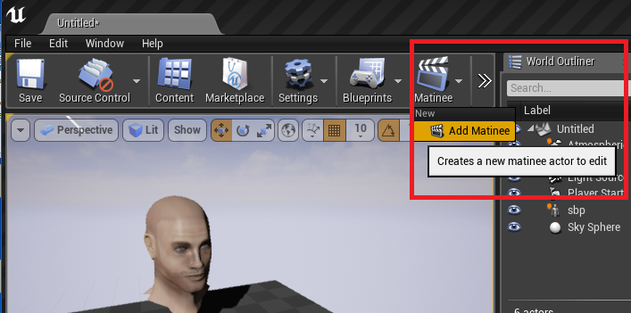
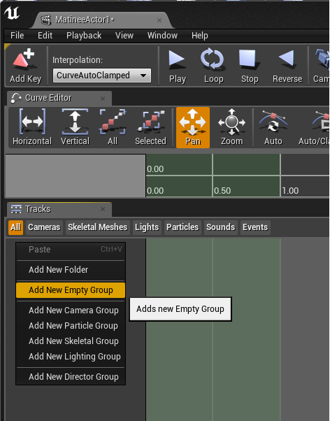
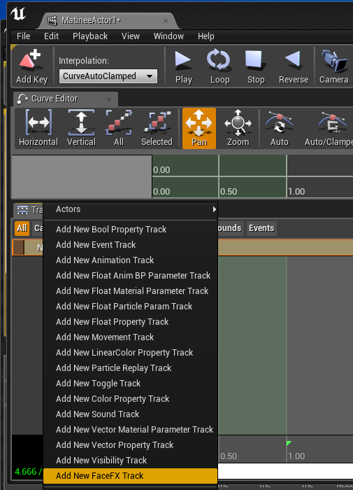
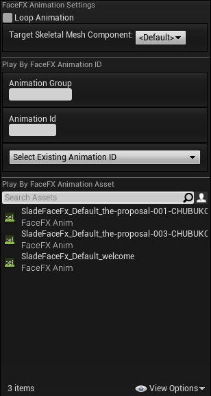

Matinee
=======

FaceFX animations can be played from Matinee.  For scripted dialogue sequences, this is the preferred method of playing a FaceFX animation in UE4.

Tutorial
--------

+ Add a Matinee to your scene.

+ Select a blueprint class in your scene that contains a **FaceFX Component**. Select exactly one object. No more, no less.  Then, From the Matinee editor, right-click in the Tracks tab and select "Add New Empty Group".  Make sure your scene object is still selected prior to doing this, as it is easy to inadvertently deselect the scene object from the Matinee tab.  When done correctly, selecting the Matinee group will select the scene object and vice versa.

+ Right-click the Matinee Group, and select **Add New FaceFX Track**

+ With the FaceFX Track selected, scrub to the time in the Matinee where you want to start the FaceFX animation, then hit **Enter** to insert a key and display the FaceFX animation selection dialog.

+ Select the FaceFX Animation you want to play.  It is your responsibility to select an animation that is compatible with the FaceFx Actor specified by the scene object.  A toaster message and errors in the log will alert you during playback if an an incompatible message was selected.  You can optionally choose to loop the FaceFX animation or change the **Target Skeletal Mesh Component**. 

+ Trigger the Matinee.  Once you have set up the Matinee, don't forget to trigger it from your game so you can see the FaceFX animations when you **Play in Editor**.  The easiest way to do this is to select the Matinee Actor from your Scene, and check the **Play on Level Load** checkbox in the Details tab.
