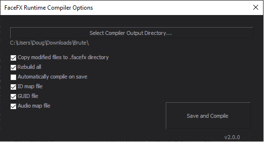

Requirements and Key Concepts
=============================

Requirements
------------

+ [FaceFX Studio Professional](https://sites.fastspring.com/facefx/checkout/fxstupro15) version 2015.1 or later is required to generate animations. FaceFX Studio requries Windows, but the data created by FaceFX Studio is usable on any platform.

    + To **evaluate** the workflow, download the [FaceFX UE4 Plugin sample content](https://unreal.facefx.com) and checkout the [FaceFX Studio Professional no-save evaluation](https://www.facefx.com/page/no-save-evaluation).

+ The FaceFX Runtime plugin for FaceFX Studio, which is available as part of the [FaceFX Runtime distribution](https://www.facefx.com/runtime-downloads), is required to process content prior to being imported into Unreal Engine 4.

+ [Unreal Engine 4](https://www.unrealengine.com) version 4.8 or later.

+ The FaceFX UE4 Plugin, which is available in a [pre-compiled binary distribution](https://unreal.facefx.com) or in [source code](https://www.github.com/FaceFX/FaceFX-UE4) form.

Key Concepts
------------

#### Software Components

There are four main software components that make up the full FaceFX UE4 Plugin workflow:

+ [FaceFX Studio Professional](https://sites.fastspring.com/facefx/checkout/fxstupro15)

+ [The FaceFX Runtime](https://www.facefx.com/runtime-downloads)

+ The FaceFX Runtime plugin for FaceFX Studio

+ [The FaceFX UE4 Plugin](https://unreal.facefx.com) itself

##### FaceFX Studio Professional

FaceFX Studio Professional is the application you use to define your character's facial setup and generate animations from audio files. You can also hand animate facial animations, either from scratch or on top of the generated animations. FaceFX Studio works with **.facefx** files that contain your character's facial setup and animations.

##### The FaceFX Runtime

The FaceFX Runtime is the component of FaceFX that runs inside the game engine and plays back and manages the data you create in FaceFX Studio Professional. The FaceFX Runtime contains a data compiler that transforms the **.facefx** file data into data that can be loaded and used by the FaceFX Runtime. The FaceFX Runtime is used by the FaceFX UE4 Plugin.

If you are a programmer and wish to know more about the FaceFX Runtime itself, you can find a detailed Programmer's Manual at **facefx/doc/pdf/manual.pdf** and an API Reference Guide at **facefx/doc/html/index.html**, both contained in the [FaceFX Runtime distribution](https://www.facefx.com/runtime-downloads).

##### The FaceFX Runtime plugin for FaceFX Studio

The FaceFX Runtime plugin for FaceFX Studio provides an interface for using the FaceFX Runtime data compiler from inside of FaceFX Studio. It also creates the **.ffxc** folder structure that is used by the FaceFX UE4 Plugin's Unreal Editor import process.

To use the FaceFX Runtime plugin for FaceFX Studio with the FaceFX UE4 Plugin, leave the compiler output directory as the default setting and make sure the following options are always **checked**:

+ Copy modified files to .facefx directory
+ ID map file
+ Audio map file
+ x86

###### The **.ffxc** folder

When you compile your actor with the FaceFX Runtime plugin for FaceFX Studio, an **<actorname>.ffxc** folder is created in the same folder as your **.facefx** file. This is what is imported when you drag your **.facefx** file onto the Unreal Engine 4 Content Browser. It contains all of the assets that have changed and need to be re-imported.

The **.ffxc** folder is required for the FaceFX UE4 Plugin to properly import FaceFX data, so always be sure that the **Copy modified files to .facefx directory** option is always **checked**.

Do not touch the **.ffxc** folder yourself.

###### Minimal Rebuild

When you have a lot of animations, compiling all of them can take a long time. Use the minimal rebuild feature to only compile animations that change.  When you are modifying your face graph, try to do it in an actor without many animations to decrease iteration times. The minimal rebuild feature is used when the **Rebuild all** option is **unchecked**.

More information about the FaceFX Runtime plugin for FaceFX Studio can be found in the **facefx/tools/compiler/plugin/README.md** file of the [FaceFX Runtime distribution](https://www.facefx.com/runtime-downloads).

##### The FaceFX UE4 Plugin

The FaceFX UE4 Plugin wraps and integrates the FaceFX Runtime into Unreal Engine 4. It consumes the data in the **.ffxc** folder created by the FaceFX Runtime plugin for FaceFX Studio.

###### Animations Must Match Their Actors

Animation assets can only be used with the same actor they were compiled for. Making any changes to the Face Graph will rebuild all of your animations.

###### Batch Import

Save time by batch importing and re-importing your animations. Drag your **.facefx** file onto the Unreal Editor's Content Browser to bring in all animations and audio files. Then right-click the **FaceFXActor** asset in the Unreal Editor's Content Browser and select "Reimport FaceFX Assets" to import any changes that were made in FaceFX Studio to the actor and/or animations.

#### Basic Workflow

+ The character's **.fbx** file is dragged onto FaceFX Studio. The **.fbx** file contains the character's mesh, skeleton, and facial bone poses (set up according to the character's batch export text file -- see the [FaceFX Studio documentation](https://www.facefx.com/FaceFXDocumentation.php) or [tutorial videos](https://www.facefx.com/video-tutorials)).

+ The character's facial setup is defined in FaceFX Studio.

+ The character's animations are generated from audio files in FaceFX Studio.

+ The character and all animations are compiled with the FaceFX Runtime plugin for FaceFX Studio, which creates a **.ffxc** folder in the same folder that contains the **.facefx** file.

+ The **.fbx** file is dragged onto the Unreal Editor's Content Browser.

+ The **.facefx** file is dragged onto the Unreal Editor's Content Browser, which imports the contents of the **.ffxc** folder and generates FaceFX assets. The **.ffxc** folder is deleted upon successful import.

+ The Assets are ready to be played by a properly set up character in Unreal Engine 4.

#### Workflow in Action

Check out the [YouTube video](https://www.youtube.com/watch?v=fCfJLtJLpnU) that demonstrates the basic FaceFX UE4 Plugin workflow in action!
