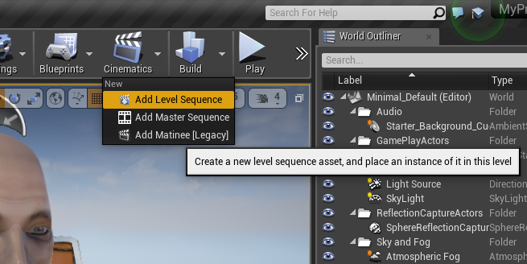
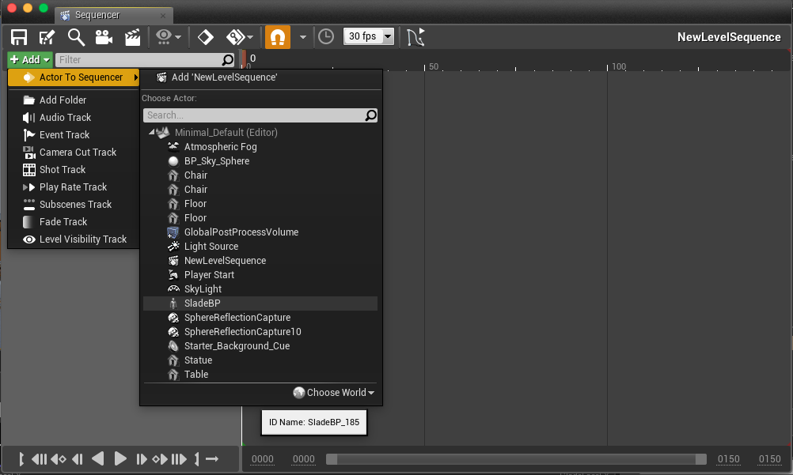
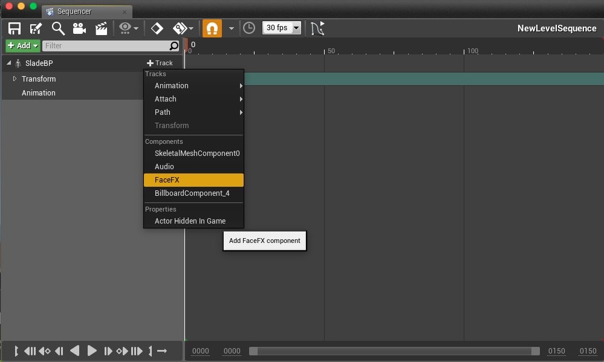
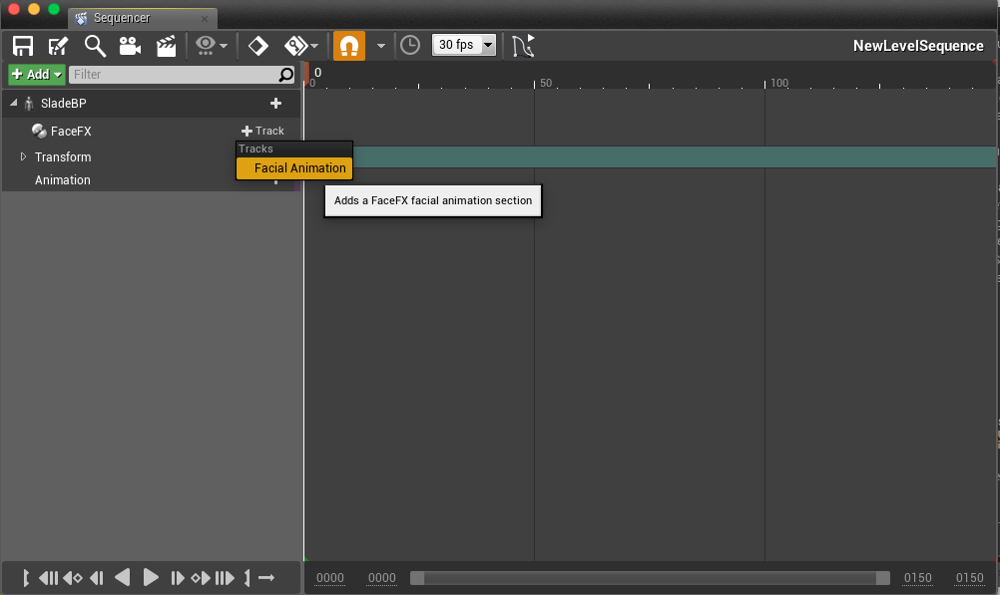
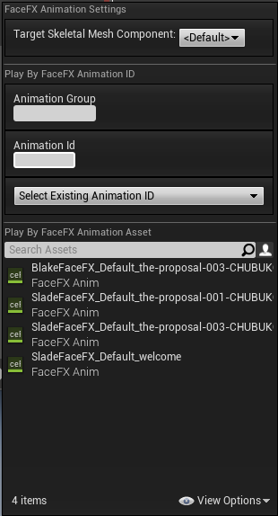

Sequencer
=======

FaceFX animations can be played from Sequencer.

Tutorial
--------

+ Add a Sequence.

+ Add an Actor to the sequence.  Make sure the actor has a FaceFX Component added to the blueprint.

+ Select **+ Track** and add a FaceFX Component Track. 

+ Add a **Facial Animation** track to the FaceFX Component Track.

+ Select the FaceFX animation you want to add.  Make sure the animation is compatible with the actor selected for the track.

+ Trigger the Sequence.  Once you have set up the Sequence, don't forget to trigger it from your game so you can see the FaceFX animations when you **Play in Editor**.  The easiest way to do this is to select **Auto play** checkbox the Seqence details.  
