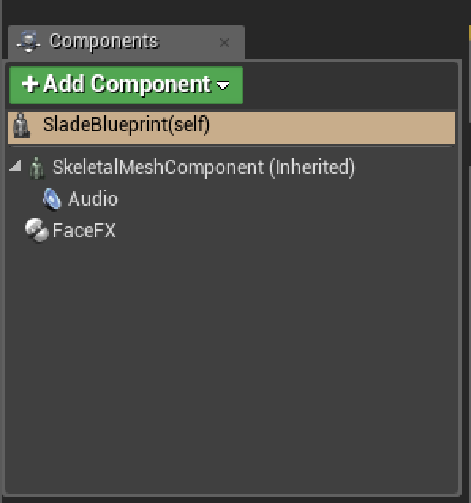

Setup
=====

FaceFX Studio Professional
--------------------------

After installing FaceFX Studio Professional, you need to install the FaceFX Runtime Plugin for FaceFX Studio. This plugin can be found in the [FaceFX Runtime distribution](https://www.facefx.com/runtime-downloads).

**Note:** The FaceFX Runtime plugin for FaceFX Studio requires FaceFX Studio Professional 2015.1 or newer.

To install the plugin, go into your **Documents** folder (e.g. C:\Users\Steve\Documents), navigate into the **FaceFX Studio 2015\Scripts** folder, create a new folder there called **FaceFXRuntime**, and copy the contents of this plugin folder there. For example, after having performed these steps, and assuming your Windows user name is Steve, you should have the following folder on your system:

C:\Users\Steve\Documents\FaceFX Studio 2015\Scripts\FaceFXRuntime

and inside that folder should be the following files:

+ \_\_init\_\_.py
+ FaceFXRuntime.py
+ README.md

Restart FaceFX Studio. After restarting FaceFX Studio you should see the option **FaceFX Runtime Compiler Options** under the **Plugins** menu. If you do not see this option, go to **Plugins -> Plugin Manager...**, scroll down until you see the **FaceFXRuntime** plugin entry, click the **Load** button, then click the **Dismiss** button. You should now see the menu option under the **Plugins** menu.

#### Optional steps

You can also copy the version of **ffxc.exe** you prefer from **facefx/tools/compiler/bin/windows** into your **FaceFXRuntime** folder to be parallel to the **FaceFXRuntime.py** file. For example, if you prefer the vs12 64-bit version, copy **facefx/tools/compiler/bin/windows/vs12/Release/ffxc.exe** into C:\Users\Steve\Documents\FaceFX Studio 2015\Scripts\FaceFXRuntime. The contents of the **FaceFXRuntime** folder would then be:

+ \_\_init\_\_.py
+ FaceFXRuntime.py
+ README.md
+ ffxc.exe

If you do not perform this step the plugin will prompt you for the location of **ffxc.exe** when you open its options dialog. **ffxc.exe** can be found in the **facefx/tools/compiler/bin/windows** folder of the [FaceFX Runtime distribution](https://www.facefx.com/runtime-downloads).

Unreal Engine 4
---------------

#### FaceFX UE4 Plugin Setup

Installation and setup instructions for the FaceFX UE4 Plugin can be found in the [README](../README.md).

#### Character Setup

In order for the FaceFX UE4 Plugin to control a character, the character first needs to be properly set up with an **Animation Blueprint** and a **Blueprint Class**.

+ Create an **Animation Blueprint** for the character and add a **Blend FaceFX Animation** node. The **Blend FaceFX Animation** node needs to be connected to the **Final Animation Pose** node via a **Component To Local** node.

+ Create a **Blueprint Class** for the character that is based on **SkeletalMeshActor** and references the **Animation Blueprint** created in the previous step. Add a **FaceFX** component and an **Audio** component to the **Blueprint Class**.

+ In the **Construction Script** of the **Blueprint Class** created in the previous step, add a **Setup FaceFX** node. Drag the **Skeletal Mesh Component** from the **Components** list into the **Construction Script** and wire it up to the **Setup FaceFX** node's **Skel Mesh Comp** slot. Finally, wire the **Construction Script** node to the **Setup FaceFX** node.

+ Animations can be played with **Play** or **Play By Id** FaceFX Blueprint nodes if they are compatible with the actor. A compatible animation is one that was compiled with the actor or compiled with an actor having an identical Face Graph setup.

